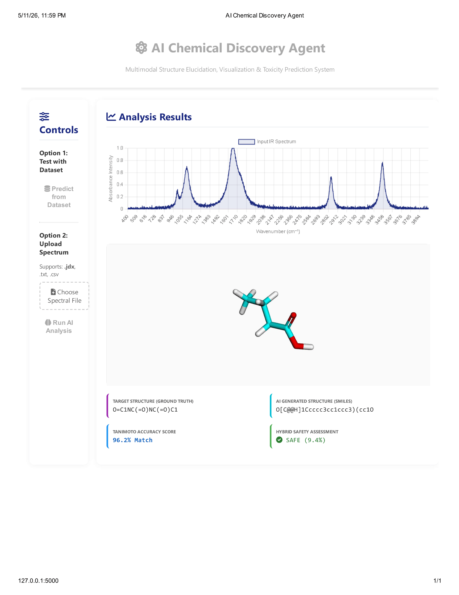

# Chemical Structure Generation and Toxicity Prediction System


**Final Year B.Tech Artificial Intelligence and Machine Learning (AI-ML) Project**  
*APJ Abdul Kalam Technological University (KTU)*

This repository contains the source code, training pipelines, and interactive web interface for an end-to-end multi-modal intelligent framework designed for environmental and health safety. The system processes multi-modal experimental spectral signals (IR, NMR, and MS) to generate chemically valid 2D and 3D molecular structures while predicting potential toxicity hazards.

## 👥 The Team
* **Agnel Miriam** 
* **Aishwarya Tharthiose** 
* **Ebin Shaji S.** 

---

## 🚀 System Architecture

The AI framework coordinates multiple advanced neural network modules into a single, unified pipeline to eliminate the dependency on manual laboratory analysis:

1. **Multi-Modal Feature Extraction (`train.py`):** 
   * Processes 1D spectral signals using Deep ResNet-1D Encoders.
   * Utilizes a Transformer-based cross-attention fusion block to combine Infrared (IR), Nuclear Magnetic Resonance (NMR), and Mass Spectrometry (MS) data into a single context vector.
2. **Molecular Structure Generation (`finetune.py`):** 
   * Employs a Validity-Aware Double Deep Q-Learning Agent.
   * Interacts with an RDKit chemical environment to construct molecular graphs atom-by-atom, enforcing valency constraints and spectral consistency.
3. **Toxicity Prediction Module (`toxicitytraining.py`):** 
   * Features a Graph Convolutional Network (GCN) that analyzes the generated molecular graph.
   * Identifies toxicophores (e.g., nitro groups, cyanides, nerve agents) using a weighted binary cross-entropy loss function to counteract dataset imbalances.
4. **Interactive Dashboard (`final.py`):** 
   * A full-stack Flask web application providing a front-end interface for real-time 3D molecular predictions, structural mapping, and hybrid safety assessments.

---

## 📂 Repository Layout & File Descriptions

This repository is organized into data processing scripts, model training pipelines, and the application core:

### Application Core
* `final.py` - The main Flask web server. It loads the pre-trained weights, parses user-uploaded spectral files (`.jdx`), runs the generation agent, and visualizes the 3D molecule and toxicity score.

### Model Training & Fine-Tuning
* `train.py` - The Phase 1 training loop. Builds the Deep ResNet + 6-Layer Transformer architecture and applies OneCycleLR scheduling to learn spectral-to-SMILES translations.
* `finetune.py` - The Phase 2 Reinforcement Learning script. Integrates the trained Transformer with a Double Deep Q-Network to maximize chemical validity rewards.
* `toxicitytraining.py` - The Graph Neural Network (GNN) safety module training script. Learns to classify molecules as safe or toxic based on molecular graph adjacency matrices.

### Data Processing & Merging
* `msdata.py` - Extracts and normalizes mass spectral peaks from massive raw MoNA SDF databases.
* `nmrdata.py` - Handles the extraction and processing of 1H and 13C experimental NMR records.
* `mergedataset.py` - A highly memory-efficient, batch-based script designed to safely merge IR, MS, and NMR datasets into a massive cohesive `.parquet` file.

---

## 📊 System Outputs & Web Interface

Our full-stack application processes uploaded spectral files to generate real-time results. Below are visual demonstrations of the AI Agent predicting structures with high accuracy alongside its safety assessment.

### Test Case 1: High Accuracy Match
*(Prediction with 94.7% Tanimoto similarity and a "Safe" hybrid assessment)*


---

## ⚙️ Installation & Setup

### 1. Clone the Repository
```bash
git clone [https://github.com/chemical-structure-generation-and-toxicity-prediction.git](https://github.com/chemical-structure-generation-and-toxicity-prediction.git)
cd chemical-structure-generation-and-toxicity-prediction
